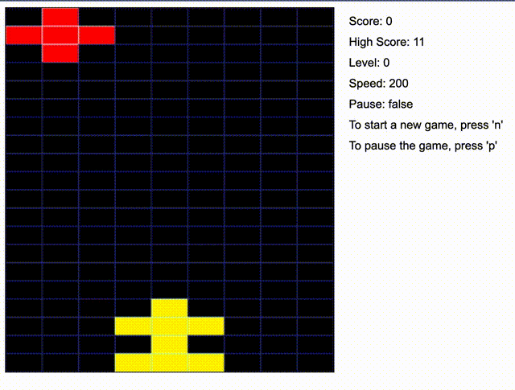

# SpedRace - Java-based Racing Game

SpedRace - это реализация классической аркадной игры "Speed Race", выпущенной компанией Taito в 1974 году, на языке программирования Java. Игра адаптирована для современного веб-интерфейса с сервером на основе REST API, позволяющим игрокам управлять гоночной машиной и избегать столкновений с машинами соперников на многополосной трассе.
## Демонстрация игры

## Содержание

- [Обзор](#обзор)
- [Компоненты](#компоненты)
- [Установка и запуск](#установка-и-запуск)
- [Использование API](#использование-api)
- [Основная логика игры](#основная-логика-игры)
- [Серверная часть](#серверная-часть)
- [Веб-интерфейс](#веб-интерфейс)
- [Лицензия](#лицензия)

## Обзор

SpedRace воспроизводит игровой процесс оригинальной аркадной игры, где игрок управляет гоночной машиной, движущейся по трассе, разделенной на три полосы. В игре постоянно генерируются машины соперников, которые движутся по трассе сверху вниз, не меняя своей полосы. Игрок должен избегать столкновений, перестраиваясь из полосы в полосу. При столкновении с машиной соперника игра завершается.

## Компоненты

Проект состоит из нескольких компонентов:

1. **Библиотека логики игры**: Реализует основную логику игры, включая управление машиной игрока, генерацию машин соперников и обработку столкновений.
2. **Сервер**: Предоставляет REST API для доступа к игре через сеть. Сервер взаимодействует с библиотекой логики игры для обработки запросов и обновления состояния игры.
3. **Веб-интерфейс**: Веб-страница, которая отображает текущее состояние игры и позволяет игроку управлять машиной.

## Установка и запуск

Для запуска игры необходимо выполнить следующие шаги:

1. **Клонирование репозитория**:
   ```bash
   git clone https://github.com/yourusername/SpedRace.git
   cd SpedRace
   ```

2. **Запуск сервера**:
   - Перейдите в папку `server`.
   - Запустите сервер, используя главный класс `BrickGameService`.

3. **Запуск веб-интерфейса**:
   - Откройте файл `index.html` в папке `web_gui` в вашем веб-браузере.

## Использование API

Сервер предоставляет два основных эндпоинта:

1. **Получение текущего состояния игры**:
   ```http
   GET /state
   ```
   Возвращает текущее состояние игры.

2. **Отправка действия игрока**:
   ```http
   POST /actions
   ```
   Принимает действие, выбранное игроком, и обновляет состояние игры.

## Основная логика игры

Основная логика игры реализована в папке `lib`. В этой папке находятся классы, отвечающие за управление машиной игрока, генерацию машин соперников и обработку столкновений.

## Серверная часть

Серверная часть проекта реализована в папке `server`. Главный класс `BrickGameService` отвечает за запуск сервера и обработку запросов через REST API.

## Веб-интерфейс

Веб-интерфейс игры находится в папке `web`. Файл `index.html` содержит веб-страницу, которая отображает текущее состояние игры и позволяет игроку управлять машиной.

